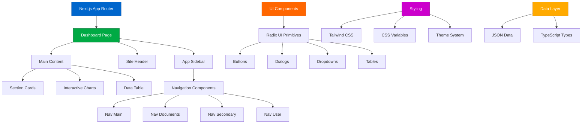
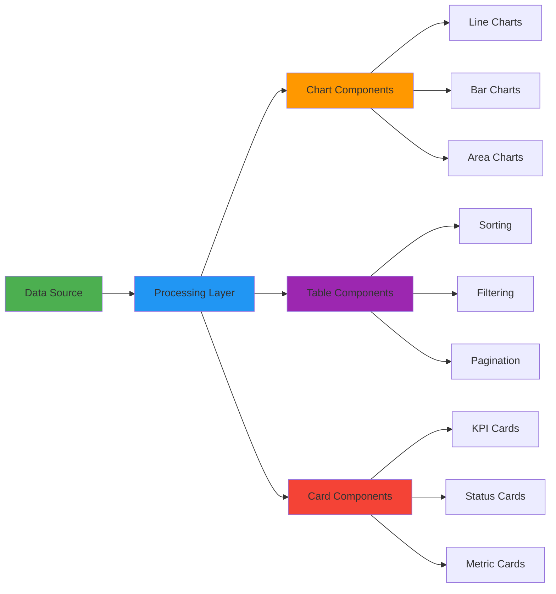

# 🚀 LingHack VI - Modern Dashboard Application

<div align="center">


**A powerful, modern dashboard application built for LingHack VI hackathon participants**

[Live Demo](#) • [Documentation](#features) • [Contributing](#contributing) • [License](#license)

</div>

---

## 🎯 About This Project

This repository contains a **production-ready dashboard application** built specifically for **LingHack VI** - a comprehensive hackathon platform that empowers developers to create, visualize, and manage data-driven applications. Built with modern web technologies, this dashboard serves as both a complete application and a foundation for hackathon participants to build upon.

### 🏆 Hackathon Context

LingHack VI challenges developers to create innovative solutions using cutting-edge technology. This dashboard application demonstrates:
- **Modern React patterns** with Next.js 15
- **Advanced data visualization** capabilities
- **Professional UI/UX design** principles
- **Scalable architecture** ready for production
- **Accessibility-first** development approach

---

## ✨ Features

### 🎨 **Modern UI Components**
- **Responsive Design**: Mobile-first approach with Tailwind CSS
- **Dark/Light Theme**: Built-in theme switching with next-themes
- **Advanced Components**: Radix UI primitives for accessibility
- **Interactive Charts**: Data visualization with Recharts
- **Drag & Drop**: Sortable lists with @dnd-kit

### 📊 **Data Management**
- **Interactive Data Tables**: Advanced filtering, sorting, and pagination
- **Real-time Updates**: Dynamic data rendering
- **Export Capabilities**: Multiple data export formats
- **Search & Filter**: Powerful search functionality

### 🔧 **Developer Experience**
- **TypeScript**: Full type safety throughout the application
- **ESLint**: Consistent code quality
- **Modern Architecture**: App Router with Next.js 15
- **Component Library**: Reusable UI components
- **Responsive Design**: Works on all device sizes

---

## 🏗️ Architecture Overview



## 🚀 Quick Start

### Prerequisites

- **Node.js** 18+ 
- **npm**, **yarn**, **pnpm**, or **bun**
- **Git** for version control

### Installation

1. **Clone the repository**
```bash
git clone https://github.com/harshith-eth/linghack6-mentor-session.git
cd linghack6-mentor-session
```

2. **Install dependencies**
```bash
npm install
# or
yarn install
# or
pnpm install
# or
bun install
```

3. **Start the development server**
```bash
npm run dev
# or
yarn dev
# or
pnpm dev
# or
bun dev
```

4. **Open your browser**
Navigate to [http://localhost:3000](http://localhost:3000) to see the dashboard in action!

---

## 📁 Project Structure

```
dashboard-app/
├── 📂 src/
│   ├── 📂 app/
│   │   ├── 📂 dashboard/
│   │   │   ├── 📄 page.tsx          # Main dashboard page
│   │   │   └── 📄 data.json         # Sample data
│   │   ├── 📄 layout.tsx            # Root layout
│   │   ├── 📄 page.tsx              # Home page (redirects to dashboard)
│   │   └── 📄 globals.css           # Global styles
│   ├── 📂 components/
│   │   ├── 📂 ui/                   # Reusable UI components
│   │   ├── 📄 app-sidebar.tsx       # Main sidebar navigation
│   │   ├── 📄 data-table.tsx        # Advanced data table
│   │   ├── 📄 chart-area-interactive.tsx # Interactive charts
│   │   ├── 📄 section-cards.tsx     # Dashboard cards
│   │   └── 📄 site-header.tsx       # Header component
│   ├── 📂 hooks/                    # Custom React hooks
│   └── 📂 lib/                      # Utility functions
├── 📂 public/                       # Static assets
├── 📄 package.json                  # Dependencies and scripts
├── 📄 tailwind.config.js           # Tailwind configuration
├── 📄 tsconfig.json                # TypeScript configuration
└── 📄 next.config.ts               # Next.js configuration
```

---

## 🎯 Core Components

### 🏠 Dashboard Layout
The main dashboard uses a **sidebar layout pattern** with:
- **Collapsible sidebar** for navigation
- **Responsive header** with user controls
- **Main content area** with interactive components

### 📊 Data Visualization


### 🎨 UI Component System
Built on **Radix UI** primitives for:
- **Accessibility** compliance
- **Keyboard navigation**
- **Screen reader** support
- **Consistent behavior** across browsers

---

## 🛠️ Technology Stack

| Category | Technology | Purpose |
|----------|------------|---------|
| **Frontend Framework** | Next.js 15 | React framework with App Router |
| **Language** | TypeScript | Type-safe development |
| **Styling** | Tailwind CSS | Utility-first CSS framework |
| **UI Components** | Radix UI | Accessible component primitives |
| **Charts** | Recharts | Data visualization library |
| **Icons** | Tabler Icons + Lucide | Consistent icon system |
| **Drag & Drop** | @dnd-kit | Accessible drag and drop |
| **Data Tables** | TanStack Table | Powerful table functionality |
| **Theme** | next-themes | Dark/light mode support |

---

## 🎨 Customization Guide

### 🎭 Theming
The application supports comprehensive theming through CSS variables:

```css
:root {
  --background: 0 0% 100%;
  --foreground: 222.2 84% 4.9%;
  --primary: 222.2 47.4% 11.2%;
  /* ... more variables */
}

.dark {
  --background: 222.2 84% 4.9%;
  --foreground: 210 40% 98%;
  /* ... dark theme variables */
}
```

### 🧩 Adding New Components
1. Create component in `src/components/`
2. Export from component file
3. Import and use in your pages
4. Follow the established patterns for styling and props

### 📊 Custom Data Sources
Replace the sample data in `src/app/dashboard/data.json` with your own data structure:

```typescript
interface DataItem {
  id: number;
  header: string;
  type: string;
  status: string;
  target: string;
  limit: string;
  reviewer: string;
}
```

---

## 🚀 Deployment

### Vercel (Recommended)
1. Push to GitHub
2. Connect to Vercel
3. Deploy automatically

### Docker
```dockerfile
FROM node:18-alpine
WORKDIR /app
COPY package*.json ./
RUN npm install
COPY . .
RUN npm run build
EXPOSE 3000
CMD ["npm", "start"]
```

### Build for Production
```bash
npm run build
npm run start
```

---

## 🤝 Contributing

We welcome contributions from hackathon participants and the developer community!

### Getting Started
1. **Fork** the repository
2. **Create** a feature branch (`git checkout -b feature/amazing-feature`)
3. **Commit** your changes (`git commit -m 'Add amazing feature'`)
4. **Push** to the branch (`git push origin feature/amazing-feature`)
5. **Open** a Pull Request

### Development Guidelines
- Follow **TypeScript** best practices
- Use **conventional commits** for commit messages
- Ensure **accessibility** standards are met
- Add **tests** for new functionality
- Update **documentation** as needed

### Code Style
- **ESLint** configuration enforces code style
- **Prettier** for consistent formatting
- **TypeScript** for type safety

---

## 📚 Learning Resources

### For Hackathon Participants
- **Next.js Documentation**: [nextjs.org/docs](https://nextjs.org/docs)
- **React Documentation**: [react.dev](https://react.dev)
- **Tailwind CSS**: [tailwindcss.com](https://tailwindcss.com)
- **TypeScript Handbook**: [typescriptlang.org](https://www.typescriptlang.org)

### Advanced Topics
- **Radix UI**: [radix-ui.com](https://radix-ui.com)
- **TanStack Table**: [tanstack.com/table](https://tanstack.com/table)
- **Recharts**: [recharts.org](https://recharts.org)

---

## 🏆 Hackathon Extensions

### 💡 Ideas for Building Upon This Project

1. **AI Integration**
   - Add GPT-powered data analysis
   - Implement natural language queries
   - Create AI-driven insights

2. **Real-time Features**
   - WebSocket integration
   - Live data updates
   - Collaborative editing

3. **Advanced Analytics**
   - Machine learning integration
   - Predictive analytics
   - Custom visualization types

4. **API Integration**
   - REST API integration
   - GraphQL support
   - Third-party service connections

5. **Mobile App**
   - React Native companion
   - PWA capabilities
   - Offline functionality

---

## 🐛 Troubleshooting

### Common Issues

**Build Errors**
```bash
# Clear Next.js cache
rm -rf .next
npm run dev
```

**Type Errors**
```bash
# Check TypeScript configuration
npx tsc --noEmit
```

**Styling Issues**
```bash
# Rebuild Tailwind CSS
npm run build
```

---

## 📄 License

This project is licensed under the **MIT License** - see the [LICENSE](LICENSE) file for details.

### MIT License Summary
- ✅ **Commercial use** allowed
- ✅ **Modification** allowed
- ✅ **Distribution** allowed
- ✅ **Private use** allowed
- ❌ **Liability** not accepted
- ❌ **Warranty** not provided

---

## 🙏 Acknowledgments

- **LingHack VI** organizers for the inspiration
- **Vercel** for Next.js and deployment platform
- **Radix UI** team for accessible components
- **Tailwind CSS** team for the utility framework
- **Open source community** for all the amazing libraries

---

## 📞 Support & Contact

- **Issues**: [GitHub Issues](https://github.com/harshith-eth/linghack6-mentor-session/issues)
- **Discussions**: [GitHub Discussions](https://github.com/harshith-eth/linghack6-mentor-session/discussions)
- **Hackathon**: Join the LingHack VI community

---

<div align="center">

**Built with ❤️ for LingHack VI**

⭐ **Star this repo** if you found it helpful!


</div>
